# Process about project #
## Folder ##

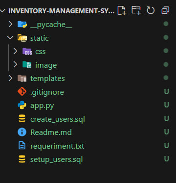

### Templates ###

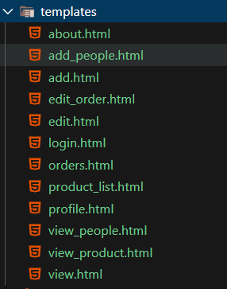

### Static ###

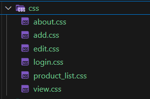

### Login page ###
- when user input about information have name, password, user can login to other page.

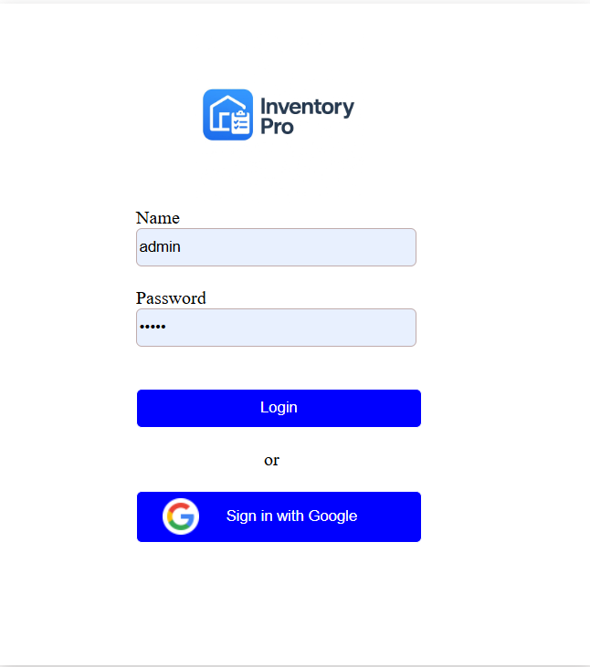

### Team page ###
- when user login already user can  see about people list that have list show about list have id, name, sex, phone, email, and position and user can delect and view about each people in the list.
- user can add about new person when user click on the button add preson.

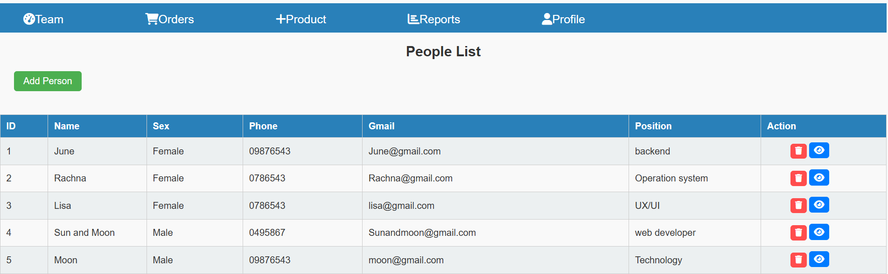

### Order page ###
- User can see list product in the list that User order when user click on status user know about product that completed and punishing also. one more thing user can edit or delete about product.

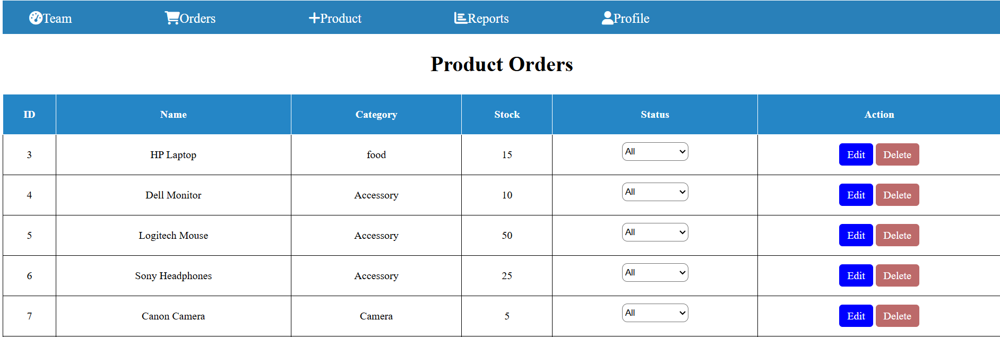

### Product page ###
- In the products page user can Add new product in the list and research by product name, category and user can download to Excel. user can edit or delete and view about product in the list.

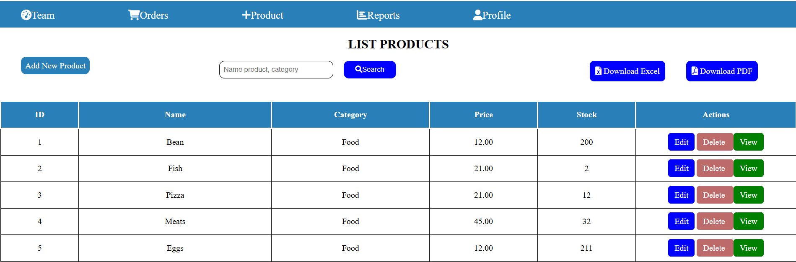

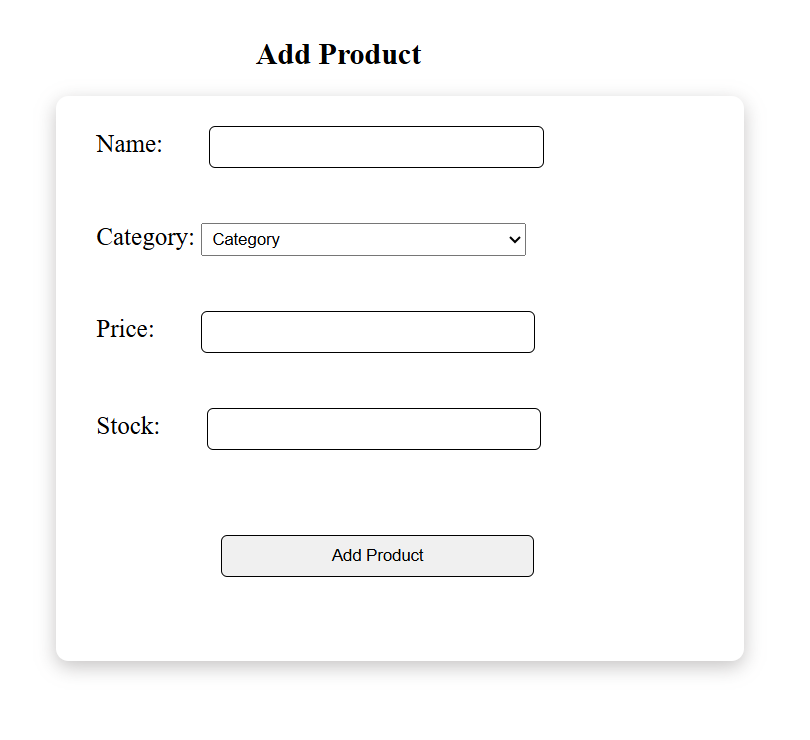

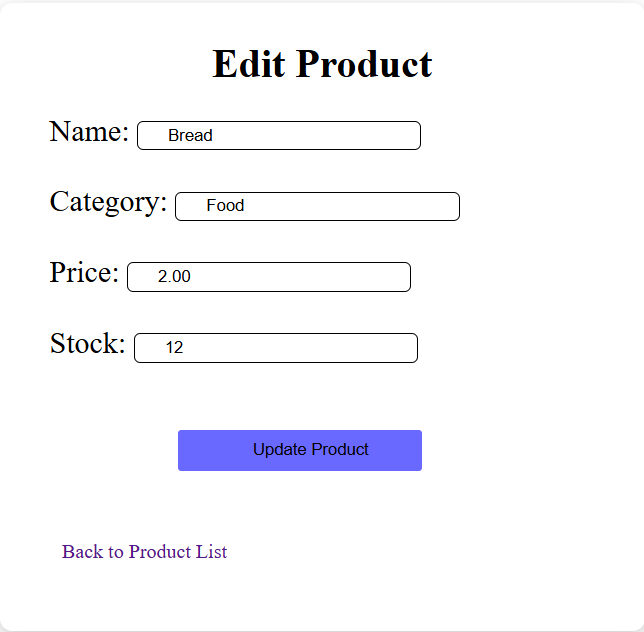

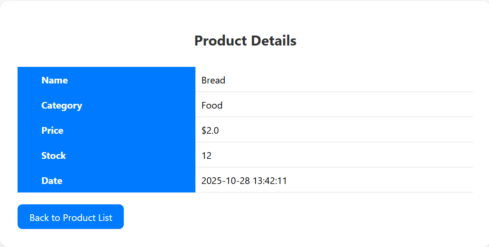

### Report page ###
- In the reports page user can know about total product, total stock,total value, and see chart that show about product in the list.
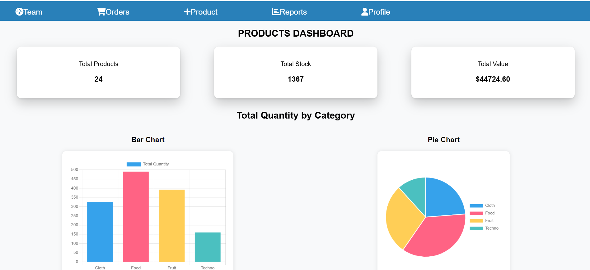

### Profile page ###
- In the profile page user can see about profile have name, emil also. when user click on the back to list user can go back to people list and button logout user go back login.

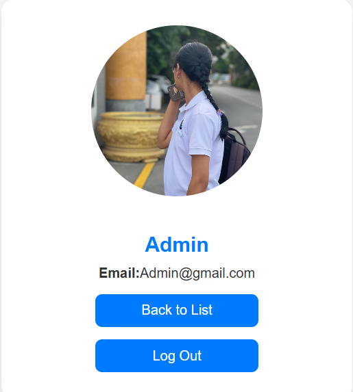

